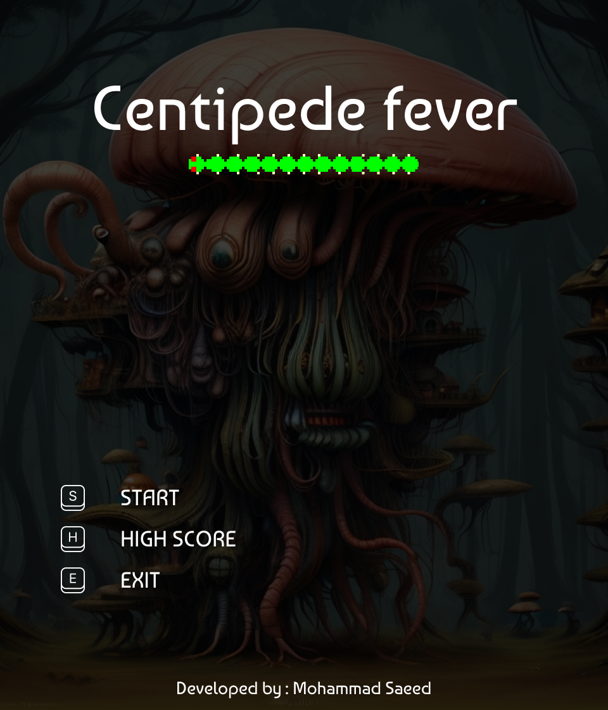
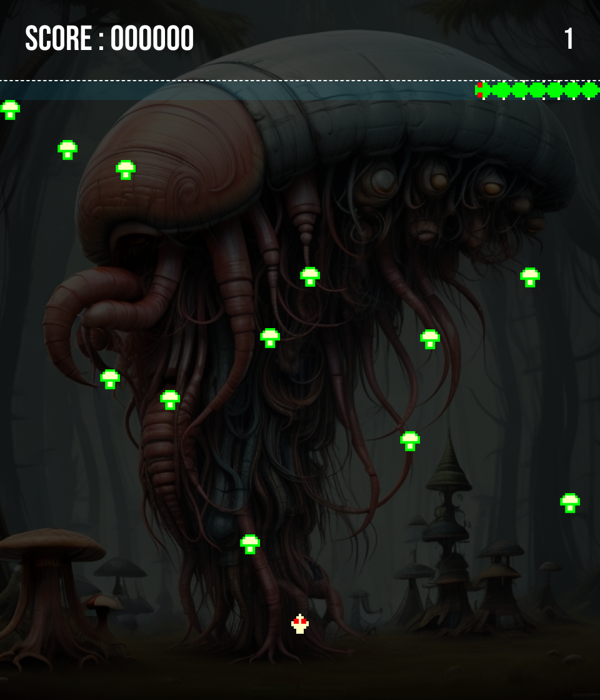
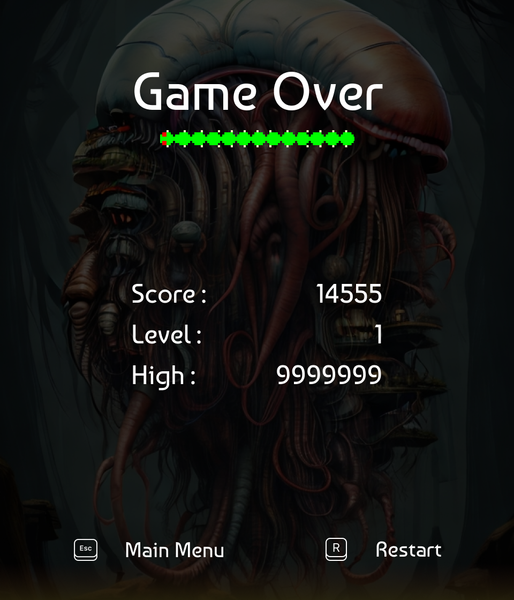

# Centipede Game

[](./ScreenShots/menu.png)
[](./ScreenShots/home.png)
[](./ScreenShots/GameOver.png)

## Table of Contents

- [Introduction](#introduction)
- [Features](#features)
- [Getting Started](#getting-started)
  - [Prerequisites](#prerequisites)
  - [Installation](#installation)
- [Usage](#usage)
- [Game Controls](#game-controls)
- [Extra Features](#extra-features)
- [Contributing](#contributing)
- [License](#license)
- [Acknowledgments](#acknowledgments)

## Introduction

Welcome to Centipede, a modernized version of the classic arcade game! This project is built in C++ using the Simple and Fast Multimedia Library (SFML) for an enhanced gaming experience. The game aims to retain the nostalgic charm of the original Centipede while introducing a better UI and additional features.

## Features

- Improved user interface
- Classic Centipede gameplay
- New Background and Level Based Game Play
- Sound effects and background music

## Getting Started

### Prerequisites

Before you begin, ensure you have the following installed:

- C++ compiler
- SFML library

### Installation

1. Clone the repository:

   ```bash
   git clone https://github.com/msaeedsaeedi/Centipede-Game.git
   ```

2. Build the project:

   ```bash
   cd centipede-game
   g++ -o centipede main.cpp -lsfml-graphics -lsfml-audio -lsfml-window -lsfml-system
   ```

3. Run the game:

   ```bash
   ./centipede
   ```

## Usage

Launch the game and start playing! Use the arrow keys to navigate and the Z to shoot. Aim for a high score and challenge your friends to beat it!

## Game Controls

- **Arrow Keys:** Move the player
- **Z:** Shoot

## Extra Features


Dive into an enriched gaming experience with these additional features:

- **Centipede Mushroom Eating:** Devour mushrooms as the centipede moves, altering its appearance.

- **Head's Generation:** Witness the dynamic generation of centipede heads, creating a visually engaging gameplay experience.

- **Mushrooms Increase on Every Level:** Each level introduces a growing number of mushrooms, escalating the challenge.

- **Nine Exciting Levels:** Progress through a total of 9 levels, each with its unique set of challenges and obstacles.

- **Poisonous Mushrooms in Player Area:** Beware of poisonous mushrooms in your territory, adding strategic depth to the game.

- **Centipede Speed Increase on Each Level:** Brace yourself for increasing speed challenges as you advance through the levels.

- **Random Entering Position of Centipede:** Experience unpredictability with the centipede entering the game at random positions.

- **Cheat Keys:** Uncover secret cheat keys for a variety of in-game advantages. Can you find them all?

## Contributing

If you'd like to contribute to the project, please follow these steps:

1. Fork the repository
2. Create a new branch (`git checkout -b feature/your-feature`)
3. Commit your changes (`git commit -m 'Add some feature'`)
4. Push to the branch (`git push origin feature/your-feature`)
5. Open a pull request

## License

This project is licensed under the [MIT License](LICENSE.md).

## Acknowledgments

- Special thanks to the creators of the original Centipede game for inspiring this project.
- Thanks to the SFML development team for providing a fantastic multimedia library.